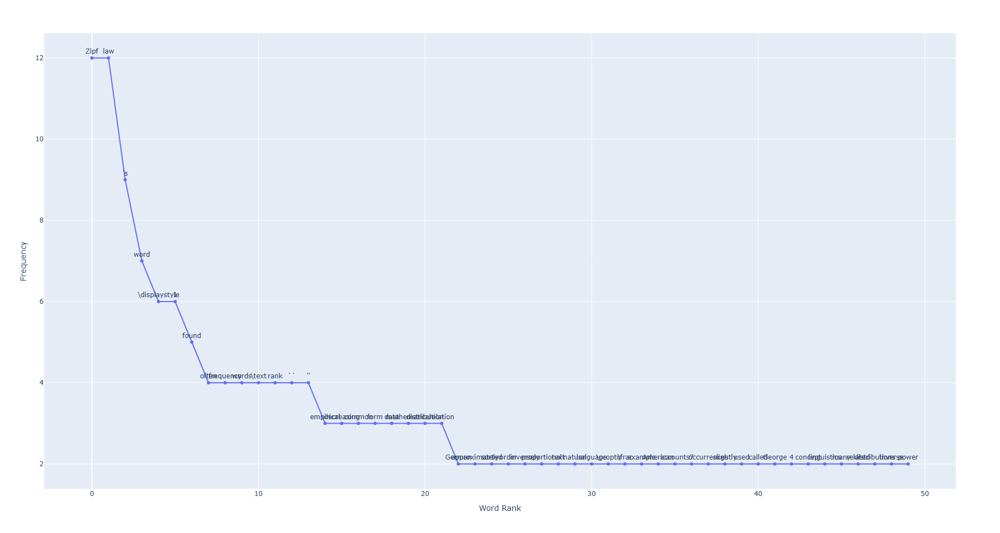

# Word Frequency Counter

<p align="center">

</p>

## 🛠️ Description

This script reads all `.txt` files in a specified directory, tokenizes the text, and counts the frequency of each word, excluding common stopwords and punctuation.

## ⚙️ Languages or Frameworks Used

- Python
- NLTK (Natural Language Toolkit)

## 📦 Requirements

Install the necessary Python packages:

```sh
pip install nltk
```

## 🌟 How to run

1. **Clone the repository**:
   ```sh
   git clone https://github.com/ndleah/python-mini-project.git
   cd Word_Frequency_Statistics
   ```

2. **Create and activate a Conda environment** (optional but recommended):
   ```sh
conda create --name word_freq_env python=3.8
conda activate word_freq_env
   ```

3. **Install the required packages**:
   ```sh
   pip install -r requirements.txt
   ```

4. **Run the script**:
   ```sh
   python main.py
   ```

   Make sure to replace `directory` in the script with the path to the directory containing your `.txt` files.

## 📺 Demo



## 🤖 Author

The name of the author of the code goes here. Feel free to link to your [GitHub](https://github.com/your-username) or personal website.
